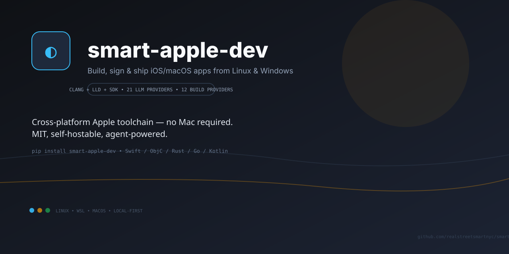
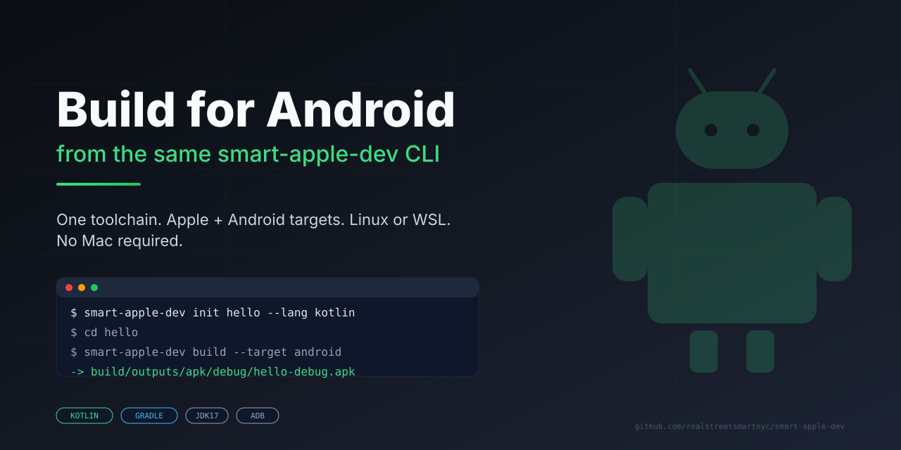

# smart-apple-dev

<p align="center"></p>

> **Social preview:** [`docs/banner.svg`](docs/banner.svg) (1280×640, charcoal/amber/civic-blue) · Also at [`assets/banner.svg`](assets/banner.svg) for GitHub social image.

Cross-platform Apple development CLI — scaffold, build, sign, and ship iOS/macOS apps from **Linux, Windows/WSL, or macOS**. No Mac required for most workflows.

[](https://github.com/realstreetsmartnyc/smart-apple-dev/actions/workflows/ci.yml)
[](https://pypi.org/project/smart-apple-dev/)
[](https://pypi.org/project/smart-apple-dev/)
[](LICENSE)
[](#)
[](https://realstreetsmartnyc.github.io/smart-apple-dev/)

> **Status: v1.0.0 — public beta.** Core pipeline verified on Linux. See [Verified Status](#verified-status) for what works today.

## Why

- **No Mac tax** — build iOS/macOS apps on Linux or Windows using clang + ld64.lld + Apple SDKs
- **Any language** — Swift, ObjC, C/C++, Rust, Go, Kotlin, and more
- **Any Mac** — local, SSH, or 10 cloud providers (GitHub Actions, AWS, BuildJet, MacStadium, …)
- **Agent-powered** — 21 LLM providers, `base:label` named instances, tool-using loop
- **Open and self-hostable** — MIT, no vendor lock-in, BYOK

## 60-Second Demo

```bash
pip install smart-apple-dev

# Check your system
smart-apple-dev doctor
smart-apple-dev info

# Scaffold and build
smart-apple-dev init hello --lang objc
cd hello
smart-apple-dev build --target macos
smart-apple-dev sign --ipa
# → build/macos/hello.ipa
```

Device install (macOS or Linux with libimobiledevice):
```bash
smart-apple-dev devices
smart-apple-dev install --ipa build/macos/hello.ipa
```

Android build (Kotlin template, JDK 17+):
```bash
smart-apple-dev init hello --lang kotlin
cd hello
smart-apple-dev build --target android
# → build/outputs/apk/debug/hello-debug.apk

# Install to a connected device or emulator
smart-apple-dev devices --platform android
smart-apple-dev install --apk build/outputs/apk/debug/hello-debug.apk
```

Agent mode (bring your own key, or local model):
```bash
# Local (no API key)
smart-apple-dev agent --provider ollama "fix the build error and re-build"

# Cloud (one of 21 providers)
smart-apple-dev agent --provider anthropic "add a settings screen to this app"

# Named instance (multiple accounts/tokens)
smart-apple-dev provider add copilot:default --api-key $GITHUB_TOKEN
smart-apple-dev agent --provider copilot:default "build for App Store"
```

### What the output looks like

```
$ smart-apple-dev build --target android
[INFO] Building hello for android via local
[OK] Build succeeded via local (kotlin)
     Build    succeeded
  Provider    local
  Language    kotlin
    Target    android
  Artifact    build/outputs/apk/debug/hello-debug.apk
  Duration    12.3s
```

## Install

```bash
pip install smart-apple-dev          # from PyPI
# or
pipx install smart-apple-dev         # isolated
# or
pip install -e ".[dev]"              # from source
```

**Requirements:** Python 3.11+

**Optional (per workflow):**

| Workflow | Needs |
|----------|-------|
| C/C++/ObjC builds | `clang`, `lld`, Apple SDK (`smart-apple-dev sdk install`) |
| Swift | `xtool` |
| Rust / Go / Kotlin | `cargo` / `go` / `kotlinc` |
| Android (Kotlin template) | JDK 17+, `ANDROID_HOME` with platform 34 + build-tools 34.0.0 |
| Signing | `ldid` (Linux) or `codesign` (macOS) — auto-fetched by `doctor --install` |
| Device install (iOS) | `libimobiledevice` (`ideviceinstaller`, `usbmuxd`) |
| Device install (Android) | `adb` (`apt install adb` / `brew install android-platform-tools`) |
| App Store upload | `fastlane` or `altool` |

## Verified Status

Every row below is tied to passing tests or manual verification on Linux (Ubuntu 22.04, Python 3.11–3.13). Nothing is claimed without evidence.

| Capability | Status | Evidence |
|------------|--------|----------|
| CLI entry point (`smart-apple-dev --version`) | ✅ | `pytest` |
| `smartapple.toml` config | ✅ | `test_config.py` |
| Build orchestrator | ✅ | `test_orchestrator.py` |
| C/C++ Mach-O builds | ✅ | `test_build_cpp.py` |
| ObjC builds (clang+SDK) | ✅ | `test_provider.py` |
| Swift (via xtool) | ✅ code, ⚠️ needs xtool on host | manual |
| Rust / Go / Kotlin | ✅ code, ⚠️ needs toolchain | manual |
| SwiftUI, watchOS, tvOS, visionOS … | 🟡 experimental templates | `templates/*` |
| JS / Java / Python / C# / game engines | 🟡 experimental backends | `src/smartapple/build/*.py` |
| Signing + IPA packaging | ✅ | `test_sign.py` |
| `ldid` auto-fetch | ✅ | `doctor.py` |
| Device helpers (iOS) | ✅ code, ⚠️ needs libimobiledevice + hardware | manual |
| Android (Kotlin) target | ✅ | `test_android_target.py`, CI `android` job |
| Android device install (adb) | ✅ code, ⚠️ needs `adb` + USB debugging | `test_android_target.py` |
| App Store helpers (`store/`) | 🟡 helpers only, no `store` CLI yet | code |
| Provider system (12 providers) | ✅ local+registry tested | `test_provider.py` |
| SSH / cloud providers | ✅ code, 🟡 needs creds | code |
| Agent loop + 10 tools | ✅ | `test_agent.py` (39 tests) |
| 21 LLM providers + `base:label` | ✅ | `test_agent.py` |
| `--json` / structured logging | ❌ planned | — |

**Known limitations:**
- Real device install needs a USB-connected, trusted iOS device + `libimobiledevice`.
- Identity signing needs your Apple Developer cert + provisioning profile.
- Apple SDKs are proprietary — supply your own (`sdk extract` on a Mac, or community MacOSX-SDKs on Linux).

## Languages

| Language | Template | Backend |
|----------|----------|---------|
| Swift | `swift` | `swift.py` (xtool) |
| Objective-C | `objc` | `objc.py` + `cpp.py` |
| C / C++ | `cpp` | `cpp.py` (clang + ld64.lld) |
| Rust | `rust` | `rust.py` (cargo) |
| Go | `go` | `go.py` |
| Kotlin | `kotlin` | `kotlin.py` |
| SwiftUI | `swiftui` | swift |
| watchOS / tvOS / visionOS | `watchos` / `tvos` / `visionos` | swift |
| JavaScript / TypeScript | `javascript` / `typescript` | `javascript.py` 🟡 |
| Java | `java` | `java.py` 🟡 |
| Python | `python` | `python.py` 🟡 |
| C# | `csharp` | `csharp.py` 🟡 |
| Godot / Unity / Unreal | `godot` / `unity` / `unreal` | `game.py` 🟡 |

```bash
smart-apple-dev init my-app --lang swift --bundle-id com.example.myapp
```

## Android Support

<p align="center"></p>

The Kotlin template is a Kotlin Multiplatform project that also builds an Android APK.
No Mac, no Xcode — just JDK 17+ and the Android SDK.

```bash
# One-time setup
export ANDROID_HOME=$HOME/Android/Sdk
yes | sdkmanager --licenses
sdkmanager "platform-tools" "platforms;android-34" "build-tools;34.0.0"

# Scaffold + build
smart-apple-dev init hello --lang kotlin
cd hello
smart-apple-dev build --target android
# -> build/outputs/apk/debug/hello-debug.apk

# Install on a connected device or emulator
smart-apple-dev devices --platform android
smart-apple-dev install --apk build/outputs/apk/debug/hello-debug.apk
```

The `--target android` flag is also accepted by `sign` and `install`. All
Android builds are verified on every push by the CI `android` job
(JDK 17 + cmdline-tools + `assembleDebug` + APK artifact check).

## Build Providers

| Provider | When to use |
|----------|-------------|
| `local` | Default. clang/ldid/SDK on your machine |
| `ssh` | Remote Mac/Linux box (`--host`, `--user`) |
| `github-actions` | CI (auto-detected) |
| `aws-mac` / `azure` | Cloud Mac instances |
| `codemagic` / `bitrise` / `buildjet` / `nevercode` | Managed CI |
| `macstadium` / `circleci` / `jenkins` | Enterprise |

```bash
smart-apple-dev build --provider local
smart-apple-dev build --provider ssh --host mac.example.com
smart-apple-dev provider list
```

## LLM Providers (Agent)

21 providers, one interface. Use `base:label` to keep multiple accounts.

```bash
# List all 21
smart-apple-dev agent --provider list

# Local (no key)
smart-apple-dev agent --provider ollama "what's the build error?"
smart-apple-dev agent --provider lmstudio "add dark mode"

# Cloud (set API key env var, or pass --api-key)
export ANTHROPIC_API_KEY=sk-...
smart-apple-dev agent --provider anthropic "refactor this"

# Named instances (persisted in ~/.smart-apple-dev/llm-providers.json)
smart-apple-dev provider add copilot:default --api-key $GITHUB_TOKEN
smart-apple-dev provider add custom:openrouter --base-url https://openrouter.ai/api/v1 --api-key $OR_KEY
smart-apple-dev provider list-instances
smart-apple-dev agent --provider copilot:default "ship it"

# Deterministic (testing / CI)
smart-apple-dev agent --provider none --plan plan.json "build and sign"
```

Supported bases: `anthropic`, `openai`, `groq`, `mistral`, `together`, `xai`, `deepseek`, `perplexity`, `copilot`, `gemini`, `opencode`, `nous`, `sambanova`, `cline`, `kilo`, `gateway`, `minimax`, `ollama`, `lmstudio`, `custom`, `none`.

## Commands

| Command | What |
|---------|------|
| `init <name> --lang <lang>` | Scaffold a project |
| `build [--target ios/macos] [--release] [--provider X]` | Build |
| `sign [--mode ad-hoc/identity/skip] [--ipa]` | Sign + package IPA |
| `install [--ipa <path>] [--device <udid>]` | Install to device |
| `devices` | List connected devices |
| `info` | Platform + SDKs + tools |
| `sdk list \| install \| extract` | Manage Apple SDKs |
| `doctor [--install]` | Diagnose / auto-fix |
| `check` | Per-language tool availability |
| `provider list \| default \| add \| del \| list-instances` | Build/LLM providers |
| `agent [--provider X] [REQUEST]` | LLM agent (one-shot or REPL) |

See [USER_GUIDE.md](USER_GUIDE.md) for full flag reference.

## Development

```bash
git clone https://github.com/realstreetsmartnyc/smart-apple-dev
cd smart-apple-dev
pip install -e ".[dev]"
python3 -m pytest -q          # 147 tests
ruff check src/ tests/        # lint
mypy src/                     # types
smart-apple-dev doctor        # system check
```

See [CONTRIBUTING.md](CONTRIBUTING.md) for guidelines.

## Verifying your install

Run the end-to-end smoke test on a fresh machine:

```bash
./verify/verify.sh                # full iOS/macOS E2E
./verify/verify-android.sh        # Android E2E (assembleDebug + adb install)
./verify/verify.sh --local        # test your local checkout
```

What it does:

- Detects platform (Linux / WSL2 / macOS)
- Installs missing system tools (`clang`, `lld`, `cmake`, …)
- Builds `ldid` from source
- Downloads + extracts the macOS SDK if missing
- Installs `smart-apple-dev` (from PyPI or local `./`)
- For each language: `init → build → sign → ipa`
- Prints a PASS/FAIL table; non-zero exit on any failure

The same logic runs on every push via [`.github/workflows/ci.yml`](.github/workflows/ci.yml)
plus a dedicated [Android job](.github/workflows/ci.yml).

## Examples

| Example | What | Build |
|---------|------|-------|
| [`examples/hello-objc/`](examples/hello-objc/) | Objective-C macOS app | `smart-apple-dev build --target macos` |
| [`examples/hello-kotlin/`](examples/hello-kotlin/) | KMP app → Android APK + iOS binary | `smart-apple-dev build --target android` |

## Pricing

**Free forever (MIT):** everything above, self-hosted, BYOK.

Paid services are opt-in (see [PRICING.md](PRICING.md)):

- **Cloud Build** — managed Mac minis, 100 min/mo free, then $19/$49/mo
- **LLM Gateway** — one key for all 21 providers, 100K tokens free
- **Sponsors** — [GitHub Sponsors](https://github.com/sponsors/smart-apple-dev) / [Polar](https://polar.sh/smart-apple-dev)

## Documentation

Full docs site: [realstreetsmartnyc.github.io/smart-apple-dev](https://realstreetsmartnyc.github.io/smart-apple-dev/)

| Doc | What |
|-----|------|
| [PUBLISH_PLAN.md](PUBLISH_PLAN.md) | Release readiness ledger |
| [ARCHITECTURE.md](ARCHITECTURE.md) | Module map |
| [USER_GUIDE.md](USER_GUIDE.md) | CLI reference |
| [PRICING.md](PRICING.md) | Free vs paid |
| [CHANGELOG.md](CHANGELOG.md) | Release notes |
| [CONTRIBUTING.md](CONTRIBUTING.md) | Dev setup |
| [SECURITY.md](SECURITY.md) | Vulnerability reporting |
| [CODE_OF_CONDUCT.md](CODE_OF_CONDUCT.md) | Community |
| [docs/](docs/) | MkDocs source for the site above |

## License

[MIT](LICENSE) — see [LICENSE](LICENSE).
